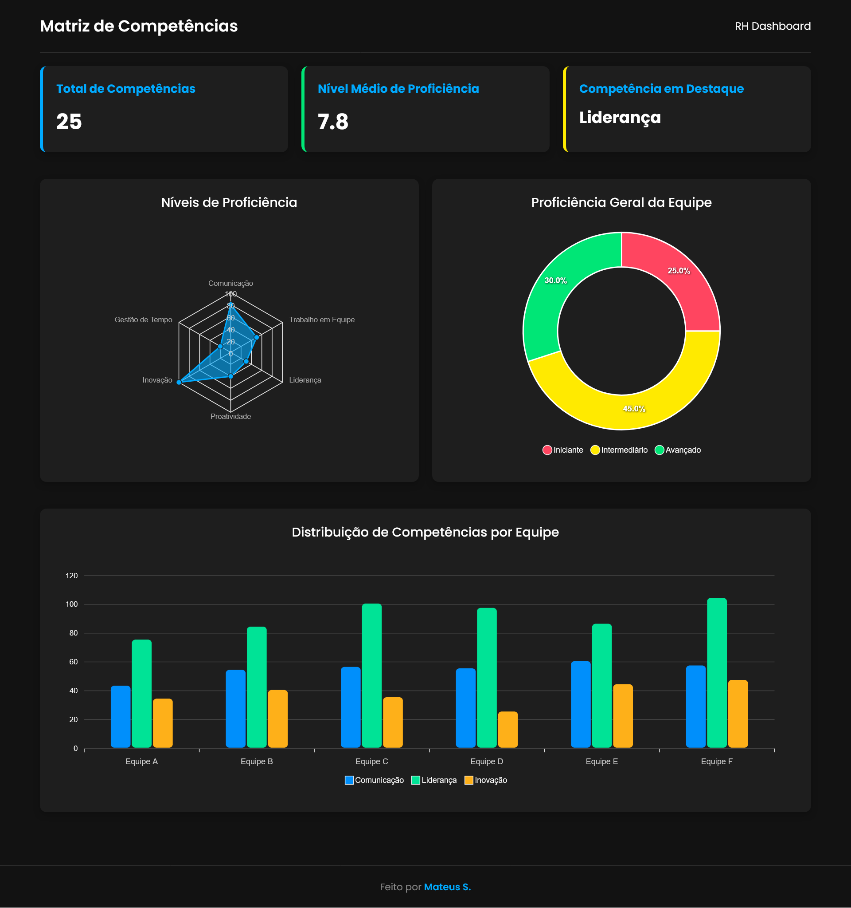

# Dashboard de Matriz Dinâmica de Competências




Um dashboard responsivo e visualmente atraente para a gestão de Recursos Humanos, focado na visualização de uma matriz de competências da equipe. O projeto foi desenvolvido com uma abordagem **mobile-first** e utiliza gráficos interativos para facilitar a análise de dados.

Feito por **[Mateus S.](https://github.com/Matz-Turing)**

---

## Funcionalidades

*   **Design Mobile-First:** Totalmente responsivo, garantindo uma ótima experiência em desktops, tablets e smartphones.
*   **Tema Escuro Moderno:** Interface elegante com fundo preto para conforto visual e estética aprimorada.
*   **Cards de Resumo:** Destaques rápidos sobre o número de competências, nível médio de proficiência e a principal competência da equipe.
*   **Gráficos Interativos:**
    *   **Gráfico de Radar:** Para visualizar os níveis de proficiência em competências-chave.
    *   **Gráfico de Barras:** Para comparar a distribuição de habilidades entre diferentes equipes.
    *   **Gráfico de Rosca:** Para mostrar a proporção de funcionários em cada nível de proficiência (iniciante, intermediário, avançado).

---

## Tecnologias Utilizadas

*   **HTML5:** Para a estrutura semântica do conteúdo.
*   **CSS3:** Para a estilização, layout (Flexbox/Grid) e responsividade.
*   **JavaScript (ES6+):** Para a lógica e a interatividade do dashboard.
*   **ApexCharts.js:** Uma biblioteca de gráficos moderna e interativa para a visualização de dados.
*   **Google Fonts:** Para uma tipografia elegante e legível (utilizando a fonte "Poppins").

---

## Estrutura de Arquivos

O projeto está organizado da seguinte forma para garantir clareza e manutenibilidade:

```
/
├── index.html          # Arquivo principal com a estrutura da página
├── styles.css          # Folha de estilos
├── script.js           # Lógica dos gráficos e interações
├── icone.png           # Ícone da aba do navegador (favicon)
└── README.md           # Documentação do projeto
```

---

## Como Executar o Projeto

Como este projeto utiliza apenas tecnologias front-end, não há necessidade de um servidor complexo ou etapas de build.

1.  **Clone o repositório:**
    ```bash
    git clone https://github.com/SEU_USUARIO/NOME_DO_REPOSITORIO.git
    ```

2.  **Navegue até a pasta do projeto:**
    ```bash
    cd NOME_DO_REPOSITORIO
    ```

3.  **Abra o arquivo `index.html`:**
    Basta abrir o arquivo `index.html` diretamente no seu navegador de preferência (Google Chrome, Firefox, etc.).

O dashboard estará funcionando localmente.
